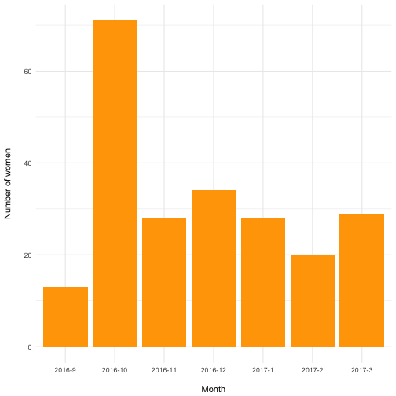

Attrition Estimation Reentry Study Chile
================

H

Function to clean dates
-----------------------

``` r
#+ function to clean dates

cleanDates <- function(text) {

  a <- data.table(text)
  a[, temp := str_extract(text, "([0-9]+/[0-9]+/[0-9]+)|([0-9]+-[0-9]+-[0-9]+)")]
  a[, temp := str_replace_all(temp, "-", "/")]
  a[grepl("20[0-9]+", temp), cc := as.Date(temp, format = "%d/%m/%Y")]
  a[is.na(cc) && !grep("20[0-9]+", temp), cc := as.Date(temp, format = "%d/%m/%y")]
  a[is.na(cc) && grep("20[0-9]+", temp), cc := as.Date(temp, format = "%d/%m/%Y")]
  a[is.na(cc) && !grep("20[0-9]+", temp), cc := as.Date(temp, format = "%y/%m/%d")]
  a[is.na(cc) && grepl("20[0-9]+", temp), cc := as.Date(temp, format = "%Y/%m/%d")]
  suppressWarnings(a[as.numeric(text) > 0, 
                     cc := as.Date(as.numeric(text), origin = "1899-12-30")])
  
  a[, year := year(cc)]
  a[, month := month(cc)]
  a[, day := day(cc)]
  
  a[month %in% c(9:12), year := 2016]
  a[month %in% c(1:8), year := 2017]
  suppressWarnings(a[, nd := ymd(paste(year, month, day, sep= "-"))])
  
  return(a$nd)
}
```

Create start date
=================

``` r
#+ define start date
setnames(dat, "FECHA EGRESO DEFINITIVA", "egreso")
setnames(dat, "FECHA EGRESO", "oegreso")

dat[, start := as.Date(egreso, format = "%Y/%m/%d")] # adjust format
dat[is.na(start), start := cleanDates(oegreso)]
summary(dat$start)
```

    ##         Min.      1st Qu.       Median         Mean      3rd Qu. 
    ## "2016-01-01" "2016-10-19" "2016-11-30" "2016-12-05" "2017-01-22" 
    ##         Max. 
    ## "2017-03-31"

``` r
dat[, month := month(start)]
dat[, year := year(start)]
dat[, date := paste0(year, "-", month)]
omonths <- paste0(c(rep(2016, length(9:12)), rep(2017, length(1:7))), "-", c(9:12,1:7))
dat[, date := factor(date, levels = omonths )]

agg <- dat[, .N, date]
ggplot(agg[!is.na(date)], aes(y = N, x = date)) + geom_bar(stat = "identity") + labs(x = "Month", y = "Cases")
```



Baseline
========

``` r
#+ baseline

# response
text <- lookvar(dat, "Sí: se realizó Línea base")
setnames(dat, text, "c1")
dat[, c1 := ifelse(grepl("^s", c1, ignore.case =  TRUE), 1, 0)]
table(dat$c1, useNA = "ifany")
```

    ## 
    ##   1 
    ## 225

``` r
# interview date
text <- lookvar(dat, "FECHA ENTREVISTA.+Primera fecha")
setnames(dat, text, "dc1")

dat[, ndc1 := cleanDates(dc1)]
dat[dc1 == "12-01.2017", ndc1 := as.Date("2017-01-12")]
dat[dc1 == "V14 y M18/10", ndc1 := as.Date("2016-10-18")]
dat[dc1 == "V16/12716", ndc1 := as.Date("2016-12-27")]

summary(dat$ndc1)
```

    ##         Min.      1st Qu.       Median         Mean      3rd Qu. 
    ## "2016-09-01" "2016-10-07" "2016-11-12" "2016-11-25" "2017-01-11" 
    ##         Max.         NA's 
    ## "2017-03-28"          "7"

First Week
==========

``` r
#+ first week

# response
setnames(dat, "PARTICIPA", "c2")
dat[, c2 := ifelse(grepl("^s", c2, ignore.case =  TRUE), 1, 0)]
table(dat$c2, useNA = "ifany")
```

    ## 
    ##   0   1 
    ##  44 181

``` r
prop.table(table(dat$c2, useNA = "ifany"))
```

    ## 
    ##         0         1 
    ## 0.1955556 0.8044444

``` r
# interview date
setnames(dat, "FECHA ENTREVISTA", "dc2")
dat[, ndc2 := cleanDates(dc2)]
dat[dc2 == "S29/10 y W02/11", ndc2 := as.Date("2016-11-02")]
summary(dat$ndc2)
```

    ##         Min.      1st Qu.       Median         Mean      3rd Qu. 
    ## "2016-09-23" "2016-10-31" "2016-12-05" "2016-12-14" "2017-01-20" 
    ##         Max.         NA's 
    ## "2017-04-12"         "51"

Two months
==========

``` r
#+ two months

# response
setnames(dat, "PARTICIPA__1", "c3")
dat[, c3 := ifelse(grepl("^s", c3, ignore.case =  TRUE), 1, 0)]
table(dat$c3, useNA = "ifany")
```

    ## 
    ##   0   1 
    ##  50 175

``` r
prop.table(table(dat$c3, useNA = "ifany"))
```

    ## 
    ##         0         1 
    ## 0.2222222 0.7777778

``` r
# interview date
setnames(dat, "FECHA ENTREVISTA__1", "dc3")
dat[, ndc3 := cleanDates(dc3)]
dat[dc3 == "13-0-2017", ndc3 := as.Date("2017-04-13")] # I guess!
dat[dc3 == "27/2", ndc3 := as.Date("2017-02-27")]
summary(dat$ndc3, useNA = "ifany")
```

    ##         Min.      1st Qu.       Median         Mean      3rd Qu. 
    ## "2016-10-24" "2016-12-26" "2017-01-26" "2017-02-12" "2017-04-09" 
    ##         Max.         NA's 
    ## "2017-07-13"         "54"

Six months
==========

``` r
#+ six months

# response
setnames(dat, "PARTICIPA__2", "c4")
dat[, c4 := ifelse(grepl("^s", c4, ignore.case =  TRUE), 1, 0)]
table(dat$c4, useNA = "ifany")
```

    ## 
    ##   0   1 
    ## 101 124

``` r
prop.table(table(dat$c4, useNA = "ifany"))
```

    ## 
    ##         0         1 
    ## 0.4488889 0.5511111

``` r
# interview date
setnames(dat, "FECHA ENTREVISTA__2", "dc4")
dat[, ndc4 := cleanDates(dc4)]
dat[ndc4 == "0207-05-15", ndc4 := as.Date("2017-05-15")]
dat[ndc4 == "3017-04-24 ", ndc4 := as.Date("2017-04-24 ")]
summary(dat$ndc4)
```

    ##         Min.      1st Qu.       Median         Mean      3rd Qu. 
    ## "2017-03-15" "2017-04-24" "2017-05-18" "2017-05-18" "2017-06-12" 
    ##         Max.         NA's 
    ## "2017-07-20"        "103"

Estimating response rates
=========================

### Baseline checks

``` r
dat[, today := today()] 

#  baseline time (in days) with respect to start

t <- as.numeric(dat$ndc1 - dat$start)
Mean(t[t <= 0]) # in days
```

    ## [1] -11.30986

``` r
Min(t[t <= 0]) # is that possible?
```

    ## [1] -111

``` r
table(t > 0) # only few cases with positive numbers
```

    ## 
    ## FALSE  TRUE 
    ##   213     5

``` r
dat[t > 0, .(id, start, ndc1, dc1, ndc2)]
```

    ##       id      start       ndc1       dc1       ndc2
    ## 1: 50037 2016-10-19 2016-10-30     42673 2016-11-02
    ## 2: 20200 2016-12-21 2016-12-26     42730 2017-02-27
    ## 3: 10202 2016-01-01 2016-12-21     42725 2017-01-08
    ## 4: 30025 2016-01-05 2016-09-21     42634       <NA>
    ## 5: 40059 2016-10-17 2016-10-19 W19/10/16 2016-10-27

### First week

``` r
dat[, week := start +  (7 * 5)] # add 5 weeks to compute rate (not useful, just doing it for completeness)
t <- as.numeric((dat$ndc2 - dat$start)/7)

Mean(t[t>0])
```

    ## [1] 1.950972

``` r
Max(t[t>0])  # is this right?
```

    ## [1] 53.28571

``` r
Min(t[t>0])
```

    ## [1] 0.1428571

``` r
dat[t <= 0, .(id, start, ndc1, ndc2, ndc3, ndc4)]
```

    ##       id      start       ndc1       ndc2       ndc3       ndc4
    ## 1: 50242 2017-02-02 2017-01-30 2017-01-21       <NA>       <NA>
    ## 2: 20032 2016-10-16 2016-09-21 2016-10-12 2016-10-26 2017-03-21
    ## 3: 20229 2017-01-18 2017-01-16 2017-01-07 2017-04-06       <NA>
    ## 4: 20071 2016-10-18 2016-10-13 2016-10-13 2016-12-15 2017-05-18
    ## 5: 50249 2017-02-09 2017-02-07 2017-01-22 2017-05-30       <NA>

``` r
(tab <- table(dat[today > week | c2 == 1, c2])) # all the sample
```

    ## 
    ##   0   1 
    ##  44 181

``` r
prop.table(tab)
```

    ## 
    ##         0         1 
    ## 0.1955556 0.8044444

``` r
rate2 <- prop.table(tab)[2]
```

### Two months

``` r
t <- as.numeric((dat$ndc3 - dat$start) / 30.5)

Mean(t[t>0])
```

    ## [1] 2.316876

``` r
Max(t[t>0])  # 4 months?
```

    ## [1] 4.491803

``` r
Min(t[t>0])
```

    ## [1] 0.3278689

``` r
dat[t < 0, .(id, start, ndc1, ndc2, ndc3,dc3, ndc4)]
```

    ##       id      start       ndc1       ndc2       ndc3   dc3       ndc4
    ## 1: 50104 2016-10-25 2016-10-24 2016-11-08 2016-10-24 42667 2017-06-27

``` r
dat[, twomonths := start + 30.5 * 4] # add 4 months
summary(dat$start)
```

    ##         Min.      1st Qu.       Median         Mean      3rd Qu. 
    ## "2016-01-01" "2016-10-19" "2016-11-30" "2016-12-05" "2017-01-22" 
    ##         Max. 
    ## "2017-03-31"

``` r
summary(dat$twomonths)
```

    ##         Min.      1st Qu.       Median         Mean      3rd Qu. 
    ## "2016-05-02" "2017-02-18" "2017-04-01" "2017-04-06" "2017-05-24" 
    ##         Max. 
    ## "2017-07-31"

``` r
length(dat[today > twomonths | c3 == 1, c3]) # almost all!
```

    ## [1] 225

``` r
(tab <- table(dat[today > twomonths | c3 == 1, c3]))
```

    ## 
    ##   0   1 
    ##  50 175

``` r
prop.table(tab)
```

    ## 
    ##         0         1 
    ## 0.2222222 0.7777778

``` r
rate3 <- prop.table(tab)[2]
```

### Six months

``` r
t <- as.numeric((dat$ndc4 - dat$start) / 30.5)

Mean(t[t>0])
```

    ## [1] 6.203171

``` r
Max(t[t>0]) 
```

    ## [1] 9.016393

``` r
Min(t[t>0]) # 4 months, really?
```

    ## [1] 4.459016

``` r
dat[t < 0, .(id, start, ndc1, ndc2, ndc3, ndc4)]
```

    ## Empty data.table (0 rows) of 6 cols: id,start,ndc1,ndc2,ndc3,ndc4

``` r
dat[, sixmonths := start + 30.5 * 8] # add 8 months


(tab <- table(dat[today > sixmonths, c4]))
```

    ## 
    ##  0  1 
    ## 30 87

``` r
prop.table(tab)
```

    ## 
    ##         0         1 
    ## 0.2564103 0.7435897

``` r
rate4 <- prop.table(tab)[2]
```

### Summary

``` r
# print rates
cbind(rate2, rate3, rate4)
```

    ##       rate2     rate3     rate4
    ## 1 0.8044444 0.7777778 0.7435897

Simulate final attrition
========================

Better than my previous computations. All the effort should be put during these last waves!

``` r
fcases <- list()
pcases <- list()
fup <- list()

for (i in 1:1000) {

dat[today < sixmonths & c4 != 1, c4_s := ifelse(runif(.N) < rate4, 1, 0)]
dat[c4 == 1, c4_s := 1]
dat[is.na(c4_s), c4_s := c4]

dat[, c5_s := 0]
dat[c4_s == 1, c5_s := ifelse(runif(.N) < .70, 1, 0)]
fcases[[i]] <- table(dat$c5_s)[2]
pcases[[i]] <- prop.table(table(dat$c5_s))[2] # respect to the total

agg <- dat[, .N, .(c1,c2,c3,c4_s,c5_s)]
s <- sum(agg$N)
agg[, prop := N / sum(N)]
agg[, followups := apply(.SD, 1, sum), .SDcols = c("c2", "c3", "c4_s","c5_s")]
fup[[i]] <- agg[followups > 2, sum(N)]/ s

}

# number of cases
summary(unlist(fcases))
```

    ##    Min. 1st Qu.  Median    Mean 3rd Qu.    Max. 
    ##     104     119     124     124     129     145

``` r
# proportion repsecto to the total sample
summary(unlist(pcases))
```

    ##    Min. 1st Qu.  Median    Mean 3rd Qu.    Max. 
    ##  0.4622  0.5289  0.5511  0.5513  0.5733  0.6444

``` r
# proportion 3 or more follow-ups
summary(unlist(fup))
```

    ##    Min. 1st Qu.  Median    Mean 3rd Qu.    Max. 
    ##  0.6444  0.6844  0.6978  0.6969  0.7111  0.7511
