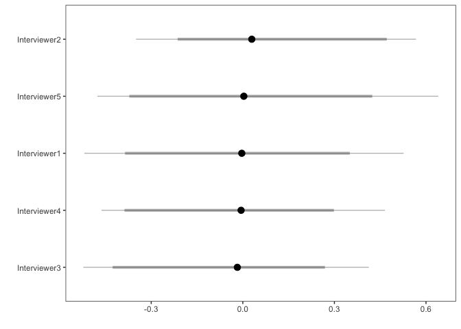

Modeling Attrition , Chile Reentry Study
================
August 10, 2017

We use the baseline dataset to explore which factors seems to predict attrition, and to identify potential biases of the data.

Descriptives
============

The total sample is 225.

``` r
summary(dat[, .(age, kids, edu, mhealth, score_mh, int_assessment)])
```

    ##       age             kids             edu            mhealth     
    ##  Min.   :19.00   Min.   : 0.000   Min.   : 0.000   Min.   :1.000  
    ##  1st Qu.:27.00   1st Qu.: 1.000   1st Qu.: 7.000   1st Qu.:2.000  
    ##  Median :34.00   Median : 2.000   Median : 8.000   Median :2.000  
    ##  Mean   :36.12   Mean   : 2.573   Mean   : 8.511   Mean   :2.262  
    ##  3rd Qu.:42.00   3rd Qu.: 4.000   3rd Qu.:12.000   3rd Qu.:3.000  
    ##  Max.   :68.00   Max.   :11.000   Max.   :16.000   Max.   :5.000  
    ##                                                    NA's   :4      
    ##     score_mh      int_assessment 
    ##  Min.   :0.0000   Min.   :1.250  
    ##  1st Qu.:0.6346   1st Qu.:3.000  
    ##  Median :0.9719   Median :3.750  
    ##  Mean   :1.0703   Mean   :3.486  
    ##  3rd Qu.:1.4213   3rd Qu.:4.000  
    ##  Max.   :3.7191   Max.   :4.000  
    ##  NA's   :1        NA's   :9

Modeling response first week
============================

### Is variance of response explained by the Interviewer?

``` r
fit1 <- stan_glmer(week ~+ (1|id_int),
                   data = dat,  family = binomial(link = "logit"))
stan_caterpillar(fit1, pars = "b\\[\\(Intercept\\) id_int\\:[0-9]\\]",
                 pars_label = paste0("Interviewer", 1:5))
```



It doesn't seem to be the case!

### Predicting response using covariates

``` r
fit1 <- stan_glmer(week ~ age + kids + edu +  score_mh +  residential_ins +  (1|id_int),
                   data = dat,  family = binomial(link = "logit"))

summary(fit1)
```

``` r
color_scheme_set("blue")
posterior <- as.matrix(fit1)
plot_title <- ggtitle("Posterior distributions",
                      "with medians and 80% intervals")
mcmc_areas(posterior,
           pars = c("age", "kids", "edu", "score_mh", "residential_ins"),
           prob = 0.8) + plot_title
```


``` r
ppc_dens_overlay(y = fit1$y,
                 yrep = posterior_predict(fit1, draws = 50))
```


