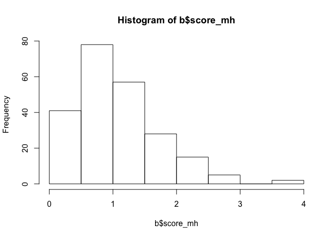
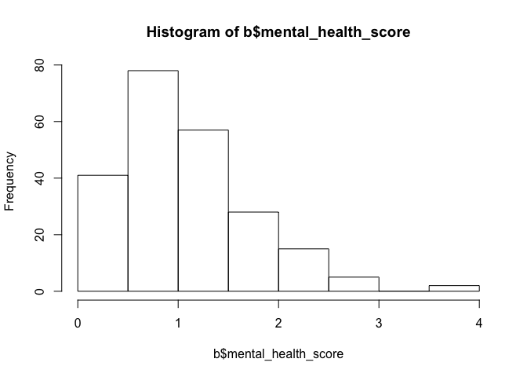

Modeling Attrition , Chile Reentry Study
================
August 12, 2017

We use the baseline dataset to explore which factors seems to predict attrition, and to identify potential biases of the data.

Data setup
==========

``` r
# get data
path <- "/Users/sdaza/Dropbox/Projects/re-entry/10 investigadores/sdaza/data/baseline/baseline_08052017.dta"
b <- as.data.table(read_stata(path))

# rename variables
setnames(b, names(b), tolower(names(b)))
ovars <- c("folio_2", "p1", "p7", "p13", "p194", "p195")
nvars <- c("id", "age", "edu", "kids", "s_health", "s_mental_heath")

setnames(b, ovars, nvars)
lb <- copy(b) # keep original version

hist(b$age)
```



``` r
##################################
# define variables
##################################

# self-reported health
vars <- c("s_health", "s_mental_heath")
dat <- assmis(b, list(vars), list(c(8,9)))

# kids binary
b[, any_kids := ifelse(kids > 0, 1, 0)]
table(dat$s_mental_heath, useNA = "ifany")
```

    ## 
    ##    1    2    3    4    5 <NA> 
    ##   26  132   47   16    2    4

``` r
# edu binary
b[, edu12 := ifelse(edu >= 12, 1, 0)] # cuarto medio +
table(b$edu12, useNA = "ifany")
```

    ## 
    ##   0   1 
    ## 161  66

``` r
# mental health
vars <- lookvar(b, "salud")
b <- assmis(b, list(vars), list(c(8,9)))
# f <- fa(b[, vars, with = FALSE], nfactors = 4)
summary(psych::alpha(as.data.frame(b[, vars, with = FALSE])))
```

    ## 
    ## Reliability analysis   
    ##  raw_alpha std.alpha G6(smc) average_r S/N    ase mean   sd
    ##       0.96      0.96    0.98      0.23  26 0.0035  1.1 0.66

``` r
b[, mental_health_score := rowscore(b, vars, type = "mean")]
summary(b$mental_health_score)
```

    ##    Min. 1st Qu.  Median    Mean 3rd Qu.    Max.    NA's 
    ##  0.0000  0.6374  0.9719  1.0734  1.4326  3.7191       1

``` r
hist(b$mental_health_score)
```



``` r
# interviewer assessment (too many missing cases)
vars <- lookvar(b, "evaluar")
b <- assmis(b, list(vars), list(c(8,9)))
b[, interviewer_assessment := rowscore(b, vars, p = 0.01)]
summary(b$interviewer_assessment)
```

    ##    Min. 1st Qu.  Median    Mean 3rd Qu.    Max.    NA's 
    ##   1.250   3.000   3.750   3.482   4.000   4.000       9

``` r
# housing
table(b$p36, useNA = "ifany")
```

    ## 
    ##   1   2   3   4   9 
    ## 167  42   9   8   1

``` r
b <- assmis(b, list("p36"), list(c(8,9)))
setnames(b, "p36", "residential_instability")

# employment
b[, employment := rowscore(b, c("p173", "p181"), type = "any", val = 1)]
table(b$employment)
```

    ## 
    ##   0   1 
    ## 116 111

``` r
table(b[, .(p173, p181)]) # formal and independent
```

    ##     p181
    ## p173   0   1
    ##    0 116  76
    ##    1  21  14

``` r
# substance use issues
b <- assmis(b, list("p210"), list(c(8,9)))
table(b$p210,  useNA = "ifany")
```

    ## 
    ##    0    1 <NA> 
    ##   99  126    2

``` r
setnames(b, "p210", "drug_use_issues")
table(b$drug_use_issues, useNA = "ifany")
```

    ## 
    ##    0    1 <NA> 
    ##   99  126    2

``` r
# drug prevalence
b[, hard_drugs := as.numeric(p212_2_d %in% c(1,2) | p212_2_e %in% c(1,2))]
# b[, .(id, hard_drugs, p212_2_d, p212_2_e)]
table(b$hard_drugs, useNA = "ifany")
```

    ## 
    ##   0   1 
    ## 157  70

``` r
# expectations to quit crime
table(b$p262, useNA = "ifany")
```

    ## 
    ##   1   2   3   4   8   9 
    ##  36  39  40 110   1   1

``` r
b <- assmis(b, list(c("p262")), list(c(8,9)))
b <- revscale(b, "p262", "expect_crime")
table(b$expect_crime, useNA = "ifany")
```

    ## 
    ##    1    2    3    4 <NA> 
    ##  110   40   39   36    2

``` r
# crimes
table(b$p137, useNA = "ifany")
```

    ## 
    ##  1  2  3  5  7  8  9 10 11 12 13 15 16 17 18 19 22 24 99 
    ##  3  4  5  1 87  1  9 11 11  1  4 37 44  1  3  1  1  2  1

``` r
b[p137 == 7 , crime := 2] # theft
b[p137 %in% c(1:6, 8:11), crime := 1] # robbery
b[p137 %in% c(15:16), crime := 3] # drugs
b[p137 %in% c(12:14, 17:24), crime := 1] # other
table(b$crime, useNA = "ifany")
```

    ## 
    ##    1    2    3 <NA> 
    ##   58   87   81    1

``` r
prop.table(table(b$crime, useNA = "ifany"))
```

    ## 
    ##           1           2           3        <NA> 
    ## 0.255506608 0.383259912 0.356828194 0.004405286

``` r
# sentence time
b <- assmis(b, list(c("p138_anos", "p138_dias", "p138_mese")), list(c(88,99)))
b[, sentence_time := sum(p138_anos * 365.25 + p138_mese * 30.5 + p138_dias, na.rm = TRUE), id]
# b[, .(id, sentence_time, p138_anos, p138_mese, p138_dias)]
# hist(log(b$sentence_time))

# select variables
nvars <- c("id", "age", "edu12", "any_kids", "s_health", "s_mental_heath",
           "mental_health_score", "interviewer_assessment",
           "residential_instability", "employment", "sentence_time", "drug_use_issues",
           "hard_drugs", "expect_crime", "crime")

b <- b[, ..nvars]

# load records
load("/Users/sdaza/Dropbox/Projects/re-entry/10 investigadores/sdaza/data/records/register.Rdata")

r <- copy(dat); remove(dat)
setnames(r, names(r), tolower(names(r)))

# select variables
setnames(r, c("fecha ingreso", "encuestadora final"), c("ad", "int"))
r[, admission := cleanDates(ad)]
svars <- c("id","int","admission","week","two_months","six_months", "cdweek", "cdtwo_months")

r <- r[, ..svars]

# create interviewer id variable
r[, id_int := .GRP, int]
table(r$id_int, useNA = "ifany")
```

    ## 
    ##  1  2  3  4  5 
    ## 33 59 58 58 17

``` r
setkey(b, id); setkey(r, id)
dat <- b[r]

# recode some variables for models
dat[, missing_week := ifelse(week == 1, 0, 1)]
dat[, missing_twomonths := ifelse(two_months == 1, 0, 1)]
dat[, log_sentence_time := scale(log(sentence_time + 0.01), center = TRUE, scale = FALSE)]
dat[, z_age := scale(age)]
dat[, z_mental_health_score := scale(mental_health_score)]
dat[, z_residential_instability := scale(residential_instability)]
dat[, crime := factor(crime, labels = c("robbery + others", "theft", "drugs"))]
# dat[, crime := relevel(crime, ref = c("drugs"))]
```

Descriptives
============

The total sample is 225.

``` r
summary(dat[, .(age, any_kids, edu12, mental_health_score, residential_instability)])
```

    ##       age           any_kids          edu12        mental_health_score
    ##  Min.   :19.00   Min.   :0.0000   Min.   :0.0000   Min.   :0.0000     
    ##  1st Qu.:27.00   1st Qu.:1.0000   1st Qu.:0.0000   1st Qu.:0.6346     
    ##  Median :34.00   Median :1.0000   Median :0.0000   Median :0.9719     
    ##  Mean   :36.12   Mean   :0.8933   Mean   :0.2889   Mean   :1.0703     
    ##  3rd Qu.:42.00   3rd Qu.:1.0000   3rd Qu.:1.0000   3rd Qu.:1.4213     
    ##  Max.   :68.00   Max.   :1.0000   Max.   :1.0000   Max.   :3.7191     
    ##                                                    NA's   :1          
    ##  residential_instability
    ##  Min.   :1.000          
    ##  1st Qu.:1.000          
    ##  Median :1.000          
    ##  Mean   :1.366          
    ##  3rd Qu.:2.000          
    ##  Max.   :4.000          
    ##  NA's   :1

Modeling non-response: First week
=================================

I show here Bayesian logistic random models where the group variable is the interviewer.

### Is variance of response explained by interviewers?

``` r
fit1 <- stan_glmer(missing_week ~+ (1|id_int),
                   data = dat,  family = binomial(link = "logit"))
stan_caterpillar(fit1, pars = "b\\[\\(Intercept\\) id_int\\:[0-9]\\]",
                 pars_label = paste0("Interviewer", 1:5))
```


It doesn't seem to be the case!

### Predicting first week non-response using covariates

``` r
fit1 <- stan_glmer(missing_week ~ z_age + any_kids + edu12 + z_mental_health_score +
                   z_residential_instability + employment + hard_drugs + crime +
                    log_sentence_time + (1|id_int),
                   data = dat,  family = binomial(link = "logit"), adapt_delta = 0.99)


# create plot
posterior <- as.matrix(fit1)

plot_title <- ggtitle("Posterior distributions Predicting Week Non-Response",
                      "with medians and 80% intervals")

# mcmc_areas(posterior) + plot_title

mcmc_areas(posterior,
           regex_pars = c("z_age", "any_kids", "edu12", "z_mental_health_score",
                    "z_residential_instability", "employment", "hard_drugs",
                    "log_sentence_time", "crime"),
           prob = 0.8) + plot_title
```


Age, employment and residential stability seem to be key factors here.

Modeling Non-response: Two months
=================================

### Is variance of response explained by interviewers?

This time there is more variability by interviewer.

``` r
fit1 <- stan_glmer(missing_twomonths ~+ (1|id_int),
                   data = dat,  family = binomial(link = "logit"))

summary(fit1)
stan_caterpillar(fit1, pars = "b\\[\\(Intercept\\) id_int\\:[0-9]\\]",
                 pars_label = paste0("Interviewer", 1:5))
```


### Predicting two-months non-response using covariates

``` r
fit1 <- stan_glmer(missing_twomonths ~ z_age + any_kids + edu12 +  z_mental_health_score +
                   z_residential_instability + employment + hard_drugs
                   + crime + log_sentence_time +
                   + (1|id_int),
                   data = dat,  family = binomial(link = "logit"), adapt_delta = 0.99)

# create plot
posterior <- as.matrix(fit1)

plot_title <- ggtitle("Posterior distributions Predicting Two Months Non-Response",
                      "with medians and 80% intervals")

# mcmc_areas(posterior) + plot_title

mcmc_areas(posterior,
           regex_pars = c("z_age", "any_kids", "edu12", "z_mental_health_score",
                    "z_residential_instability", "employment", "hard_drugs",
                    "log_sentence_time", "crime"),
           prob = 0.8) + plot_title
```


Same patterns, although noisier estimates. Non-response, as expected, is not random and we will need to correct potential biases by imputing or weighting.
